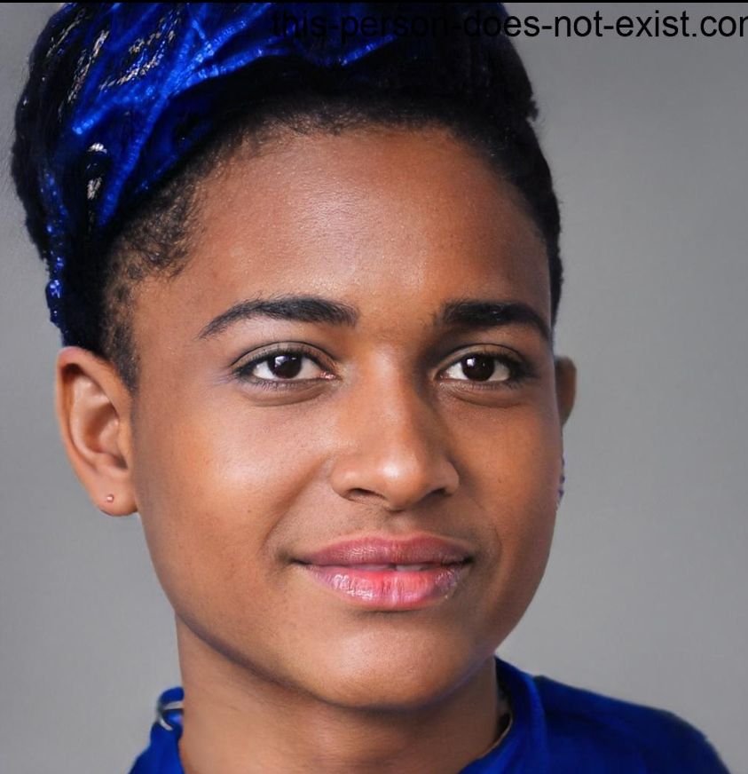
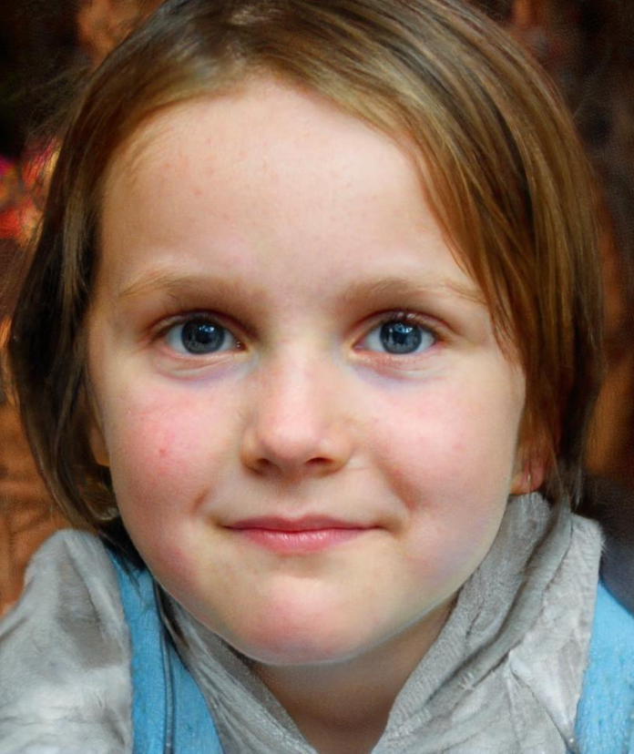

# Personas

## Introdução

Neste documento, temos a exposição das personas criadas pelo grupo. Esta técnica consiste em criar personagens fictícios (personas) para realizar a técnica de roleplay (encenação) e, assim, obter mais requisitos para a aplicação. Essa técnica é extremamente útil, pois permite imaginar as limitações e necessidades de uma persona ao utilizar a aplicação. Temos a seguinte divisão de personas:

- Persona primária: é aquela para qual o programa foi feito e sempre está engajada com a aplicação.
- Persona secundária: é aquela que eventualmente utiliza a aplicação, normalmente sem muitas exigências.
- Anti-Persona: é aquela para a qual a aplicação não foi destinada.

## Perfil de Usuário

Para que sejam definidas as personas, primeiramente é necessário definir o perfil de usuário. Perfil de usuário é uma descrição detalhada das características dos usuários cujos objetivos devem ser apoiados pelo sistema sendo projetado (Barbosa, 2021).

Com base nas informações obtidas por meio da técnica de coleta de dados por questionário, é factível criar perfis de usuários que compartilham características similares.

Perfil de usuário:

Os usuários do Simplenote têm entre 17 e 40 anos e são estudantes do ensino médio, ensino superior ou têm ambos completos. Eles estão em busca de soluções para organizar suas rotinas e aumentar sua produtividade nos estudos ou no trabalho.

## Personas

### Enzo Gabriel - Persona primária

<figcaption align='center'>
    <b>Figura 1: Enzo Gabriel (persona-primária).</b>
     <small>Fonte: <a href='https://this-person-does-not-exist.com/en'>Thispersondoesnotexist</a> </small>
</figcaption>

 

| Caracteristica       | Resposta                                                                                                                                                                                                          |
| :------------------- | ----------------------------------------------------------------------------------------------------------------------------------------------------------------------------------------------------------------- |
| **Nome**             | Enzo Gabriel.                                                                                                                                                                                                     |
| **Idade**            | 17 Anos.                                                                                                                                                                                                          |
| **Gênero**           | Masculino.                                                                                                                                                                                                        |
| **Localidade**       | São Paulo, capital, Brasil.                                                                                                                                                                                       |
| **Particularidades** | Palmeirense e Usuário de discord.                                                                                                                                                                                 |
| **Escolaridade**     | Cursando Ensino médio.                                                                                                                                                                                            |
| **Profissão**        | Estudante.                                                                                                                                                                                                        |
| **História**         | Enzo Gabriel sempre teve dificuldade na escola, gosta muito de jogos online e de jogar futebol. Atualmente, Enzo busca melhorar suas notas.                                                                       |
| **Objetivos**        | Melhorar o desempenho escolar e otimizar seu tempo através do aplicativo Simplenote.                                                                                                                              |
| **Habilidades**      | Muito bom em matemática.                                                                                                                                                                                          |
| **Rotina**           | De manhã ele vai para a escola, e por volta de 13:50, almoça em casa e divide a sua tarde entre os estudos e seus vícios. Pela noite, ele joga um pouco e vai dormir por volta de 22:00, sob bronca de seus pais. |
| **Relacionamentos**  | Conversa com colegas do discord e sua meia dúzia de amigos escolares.                                                                                                                                             |
| **Requisitos**       | Enzo gostaria de poder compartilhar suas notas com seus colegas de turma, para que todos tenham eficiência em seus estudos.                                                                                       |
| **Expectativas**     | Deseja organizar suas atividades escolares de forma à não esquecê-las                                                                                                                                             |

Tabela 1: Persona 1 - Enzo Gabriel

Fonte: Ian da Costa

 

### Alicia Kane - Persona primária

<figcaption align='center'>
    <b>Figura 2: Alicia Kane (persona-primária).</b>
     <small>Fonte: <a href='https://this-person-does-not-exist.com/en'>Thispersondoesnotexist</a> </small>
</figcaption>

 

| Caracteristica       | Resposta                                                                                                                                                                                                                                                                                                                                             |
| :------------------- | ---------------------------------------------------------------------------------------------------------------------------------------------------------------------------------------------------------------------------------------------------------------------------------------------------------------------------------------------------- |
| **Nome**             | Alicia Kane.                                                                                                                                                                                                                                                                                                                                         |
| **Idade**            | 25 anos.                                                                                                                                                                                                                                                                                                                                             |
| **Gênero**           | Feminino.                                                                                                                                                                                                                                                                                                                                            |
| **Localidade**       | Londres, Inglaterra.                                                                                                                                                                                                                                                                                                                                 |
| **Particularidades** | Ativista social e Universitária de ciências físicas em Cambridge.                                                                                                                                                                                                                                                                                    |
| **Escolaridade**     | Cursando o ensino superior.                                                                                                                                                                                                                                                                                                                          |
| **Profissão**        | Estudante e estagiária.                                                                                                                                                                                                                                                                                                                              |
| **História**         | Alicia sempre foi apaixonada pela luta por direitos iguais e justiça social. Com dedicação, ela conseguiu ingressar na Universidade de Cambridge, onde estuda ciências físicas. Além disso, Alicia se dedica a ser uma ativista social comprometida e ajuda o máximo de pessoas que pode. Com sua determinação, ela busca mudar o mundo para melhor. |
| **Objetivos**        | Conseguir com a ajuda do aplicativo, manter seus pensamentos organizados e focar em seus objetivos, mesmo enquanto enfrenta uma carga de trabalho pesada na universidade.                                                                                                                                                                            |
| **Habilidades**      | Forte senso de justiça social e habilidade de liderança e organização para planejar e executar projetos sociais                                                                                                                                                                                                                                      |
| **Rotina**           | Pela manhã acorda, estuda até meio dia, almoça e pela tarde vai para o seu estágio, volta para casa e a noite, Alicia costuma relaxar fazendo atividades que lhe dão prazer, como ler livros, ouvir música ou assistir filmes.                                                                                                                       |
| **Relacionamentos**  | Conversa com seus amigos, pais e colegas de faculdade e estágio.                                                                                                                                                                                                                                                                                     |
| **Requisitos**       | Alicia gostaria de sincronização em nuvem, o app deve permitir que as notas sejam sincronizadas automaticamente em vários dispositivos do usuário, para que se possa acessá-las de onde estiver.                                                                                                                                                     |
| **Expectativas**     | Deseja que o app seja compatível com diferentes sistemas operacionais, para que se possa usá-lo independentemente da plataforma que estiver usando.                                                                                                                                                                                                  |

Tabela 2: Persona 2 - Alicia Kane

Fonte: Ian da Costa

 

### Valentina Becker - Persona Secundária

<figcaption align='center'>
    <b>Figura 3: Valentina Becker (persona-secundária).</b>
     <small>Fonte: <a href='https://this-person-does-not-exist.com/en'>Thispersondoesnotexist</a> </small>
</figcaption>

 

|        Caracteristica       |  Resposta   |
| :------------------ | --------------------------------------------------------------------------------------------------------------------------------------------------------------------------------------------------------------------------------------------------------------------------------------------------------------------------------------------------------------------------------------------------------------------------------------------------------------------------------------------------------------------------------------------------------------------------------------------------------------------- |
| **Nome**            | Valentina Becker.    |
| **Idade**            |          10 anos.     | 
| **Gênero**       | Feminino.      |
| **Localidade**            |        Porto Alegre, Rio grande do Sul, Brasil.       |   
| **Particularidades**            |        Gosta muito de desenhar e pintar   | **Escolaridade**            |        Cursando o ensino fundamental 1.      |    
| **Profissão**            |        Estudante.   |   
| **História**            | Valentina é filha de classe média-alta Porto alegrense, desde cedo foi matriculada em um curso particular de desenho, a qual se especializou e têm uma uma habilidade fantástica para desenhar  | 
| **Objetivos**       | Apenas estudar e se divertir. |
| **Habilidades**     | Capacidade alta de aprendizado artístico.  |
| **Rotina**         | Ao acordar cedo, ela toma um café e segue para o cursinho de desenho, onde passa a manhã aprimorando suas habilidades. Após o término da aula, almoça rapidamente e segue para a escola, onde passa a tarde toda. Ao chegar em casa, assiste suas séries favoritas em seu tablet, janta e logo vai dormir.   |
| **Relacionamentos** | Conversa com seus pais, secretária de casa e suas colegas de cursinho e escola.   |
| **Requisitos**      | Valentina gostaria que o Simplenote tivesse um modo de escrita livre para que pudesse utilizar sua caneta touch para fazer seus desenhos. |
| **Expectativas**    | Desenhar no aplicativo Simplenote. |

Tabela 3: Persona 3 - Valentina Becker

Fonte: Ian da Costa

 

### Walter Assis da Gama (Seu Nenê) - Anti-persona

<figcaption align='center'>
    <b>Figura 4: Seu Nenê (Anti-persona).</b>
     <small>Fonte: <a href='https://this-person-does-not-exist.com/en'>Thispersondoesnotexist</a> </small>
</figcaption>

 

| Caracteristica       | Resposta                                                                                                                                                                                                                                                |
| :------------------- | ------------------------------------------------------------------------------------------------------------------------------------------------------------------------------------------------------------------------------------------------------- |
| **Nome**             | Walter Assis da Gama (Seu Nenê).                                                                                                                                                                                                                        |
| **Idade**            | 70 anos.                                                                                                                                                                                                                                                |
| **Gênero**           | Masculino.                                                                                                                                                                                                                                              |
| **Localidade**       | São Cristóvão, Rio de Janeiro, Brasil.                                                                                                                                                                                                                  |
| **Particularidades** | Viúvo.                                                                                                                                                                                                                                                  |
| **Escolaridade**     | Ensino médio incompleto.                                                                                                                                                                                                                                |
| **Profissão**        | Aposentado.                                                                                                                                                                                                                                             |
| **História**         | Seu Nenê é aposentado, mas devido a sua infância conturbada e a força de vontade, está sempre atrás de alguma fonte de renda além de sua aposentadoria.                                                                                                 |
| **Objetivos**        | Após a sua aposentadoria, seu Nenê constantemente se sente mal por não estar ocupado com algo, o mesmo deseja algo para se ocupar.                                                                                                                      |
| **Habilidades**      | Bastante força devido ao seu modo de vida.                                                                                                                                                                                                              |
| **Rotina**           | Seu nenê é bastante ocupado apesar de sua idade, pela manhã ele faz a sua comida, pela tarde ele se dirige para a rua com a finalidade de encontrar algum serviço, ele volta para casa à noite a fim de descansar, ele dorme cedo, entre 20:00 e 21:30. |
| **Relacionamentos**  | Conversa com seus netos e seus amigos de bairro.                                                                                                                                                                                                        |
| **Requisitos**       | Seu Nenê quer descansar quando chega em casa e se sente motivado a escrever sua história de vida para registrar seu passado, entretanto, ele precisa de facilidade.                                                                                     |
| **Expectativas**     | Seu Nenê quer viver uma vida feliz até o final de sua existência.                                                                                                                                                                                       |

Tabela 4: Persona 4 - Walter Assis da Gama (Seu Nenê)

Fonte: Ian da Costa

## Bibliografia

[1] Barbosa, S. D. J.; Silva, B. S. da; Silveira, M. S.; Gasparini, I.; Darin, T.; Barbosa, G. D. J. (2021) Interação Humano-Computador e Experiência do usuário. Autopublicação. ISBN: 978-65-00-19677-1.

[2] This Person Doest Not Exist. Acesso em: 09 de Abril de 2022.Disponível em: <https://this-person-does-not-exist.com/en>  

## Histórico de Versão

| Versão | Data       | Descrição                                                        | Autor(es) | Revisor(es) |
| ------ | ---------- | ---------------------------------------------------------------- | --------- | ----------- |
| `1.0`  | 09/04/2023 | Criação do documento e inicio da criação das personas.           | Kauã      | João        |
| `2.0`  | 09/04/2023 | Atualização de todas as personas e criação do perfil de usuário. | Ian       | Mylena      |
