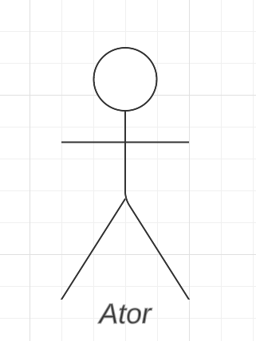
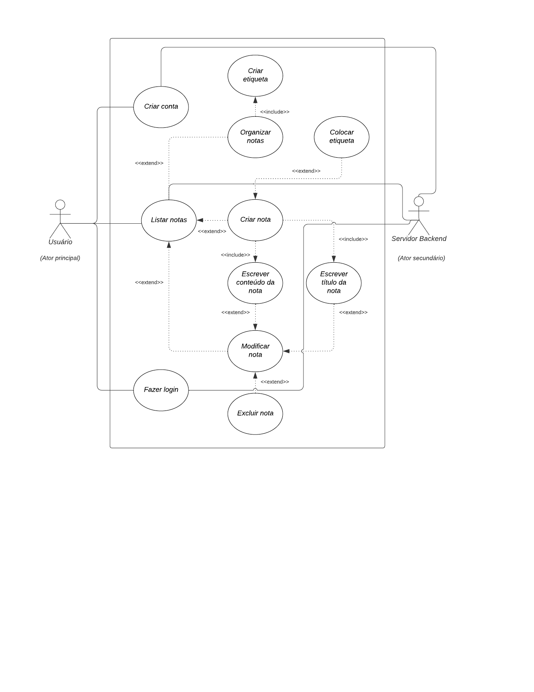

# Casos de Uso

## Introdução
Um diagrama de casos de uso é uma representação visual que descreve as interações entre um sistema e os usuários externos. Ele é composto por uma série de ações, chamadas de casos de uso, que ilustram as principais funcionalidades do sistema e como elas são executadas pelos usuários. Essa ferramenta é útil para documentar e comunicar de forma clara e concisa o comportamento esperado do sistema, bem como a interação entre seus usuários e suas funcionalidades.

## Metodologia
Para a criação desse artefato foi utilizado a abordagem tradicional, ou seja, representação os casos de uso através de uma diagrama UML. A ferramenta utilizada para a criação do diagrama foi o LucidChart, um software online para criação de diagramas.

Para realizar o caso de uso, contamos com a Persona [Alicia Kane](../elicitacao/personas.md) para compreender de forma mais profunda o que os usuários finais do sistema realmente querem e desejam. Ao incluir a persona [Alicia Kane](../elicitacao/personas.md) em um diagrama de caso de uso, conseguimos criar representações de situações reais de uso do sistema que levam em consideração as diferentes necessidades e metas do tipo de usuário que ela representa.

## Componentes
### Atores
Representam as pessoas que realmente executam os casos de uso. São representados por bonecos palito, conforme a Figura 1 abaixo.

Figura 1: Ator

Fonte: Ian Costa, LucidChart 

### Caso de uso
Representam os diferentes usos que um usuário pode ter. São representados por um formato oval rotulado, conforme a Figura 2 abaixo.

Figura 2: Caso de uso

Fonte: Ian Costa, LucidChart 

### Comunicação
Ação que comunica o usuário ao caso de uso. Pode ser definida como inclusão ou exclusão, conforme a Figura 3 abaixo.

Inclusão: Refere-se à relação em que um caso de uso requer a funcionalidade de outro caso de uso para ser executado. Em termos simples, quando um caso de uso A inclui um caso de uso B, significa que sempre que o caso de uso A for executado, o caso de uso B também será executado obrigatoriamente.

- Notação no diagrama: *<<includes\>\>*

Extensão: Por outro lado, a extensão implica que o caso de uso atual funcionará normalmente, mas alguns novos passos serão adicionados por meio de um caso de uso estendido. Em outras palavras, quando o caso de uso A é estendido pelo caso de uso B, se o caso de uso A for executado, o caso de uso B pode ou não ser executado como uma extensão opcional.
- Notação no diagrama: *<<extends\>\>*

Figura 3: Comunicação

Fonte: Ian Costa, LucidChart 

### Limite do Sistema
Define um escopo do sistema para os casos de uso. É representado por um retângulo englobando os Casos de  Uso (forma oval rotulada), conforme a Figura 4 abaixo.

Figura 4: Limite do Sistema

Fonte: Ian Costa, LucidChart 

## Diagrama de Caso de Uso

Figura 5: Diagrama UML

Ator Principal: Ator. // Ator Secundário: Servidor Backend.

Fonte: Ian Costa 

Especificação dos casos de uso identificados:

### UC01. Cria nota

|                    UC01 | Criar uma nota                                                 |
| ----------------------: | :------------------------------------------------------------- |
|              **Atores** | Usuário                                                        |
|               **Local** | Escola                                                         |
|         **Data e Hora** | Segunda-feira pela manhã antes da aula                         |
|          **Requisitos** | Aplicativo instalado                                           |
| **Condição de entrada** | O usuário toca o ícone para criar nova nota                    |
|     **Fluxo principal** | O sistema cria uma nova nota para o usuário                    |
| **Fluxos alternativos** | Não há                                                         |
|   **Fluxos de exceção** | Não é possível criar nova nota pois o armazenamento está cheio |
|       **Pós condições** | O usuário tem uma nova nota em sua coleção de notas            |
|     **Rastreabilidade** | [B01](../elicitacao/brainstorming.md)                          |

 Tabela 1: Especificação do caso de uso: Criar nova nota. (Fonte: Ian, 2023).

### UC02. Modificar Nota

|                    UC02 | Modificar nota                                                    |
| ----------------------: | :---------------------------------------------------------------- |
|              **Atores** | Usuário                                                           |
|               **Local** | No quarto de casa                                                 |
|         **Data e Hora** | Quarta-feira de noite após o trabalho                             |
|          **Requisitos** | Ter uma nota já existente.                                        |
| **Condição de entrada** | O usuário seleciona a nota desejada e a modifica.                 |
|     **Fluxo principal** | O usuário altera o conteúdo do título ou do corpo da nota.        |
| **Fluxos alternativos** | O usuário exclui a nota                                           |
|   **Fluxos de exceção** | A nota que o usuário quer modificar não existe ou já foi excluída |
|       **Pós condições** | Ter uma nota criada previamente                                   |
|     **Rastreabilidade** | [B02, B03, B10, B18](../elicitacao/brainstorming.md)              |

 Tabela 2: Especificação do caso de uso: Modificar nota. (Fonte: Ian, 2023).

### UC03. Organizar notas

|                    UC03 | Organizar notas                                                |
| ----------------------: | :------------------------------------------------------------- |
|              **Atores** | Usuário                                                        |
|               **Local** | No escritório de trabalho                                      |
|         **Data e Hora** | Sexta feira pela manhã antes de uma reunião                    |
|          **Requisitos** | Ter uma ou mais notas criadas                                  |
| **Condição de entrada** | O usuário seleciona a opção adicionar etiqueta à nota desejada |
|     **Fluxo principal** | É adicionado uma etiqueta (tag) à nota escolhida               |
| **Fluxos alternativos** | Não há                                                         |
|   **Fluxos de exceção** | A nota já possui a etiqueta que se tenta adicionar             |
|       **Pós condições** | A nota fica etiquetada e fácil de encontrar                    |
|     **Rastreabilidade** | [B04, B05](../elicitacao/brainstorming.md)                     |

 Tabela 3: Especificação do caso de uso: Organizar notas. (Fonte: Ian Costa, 2023).

## Bibliografia

> [1] LUCIDCHART - Diagrama de Caso de Uso UML - https://www.lucidchart.com/pages/pt/diagrama-de-caso-de-uso-uml. 
> [2] UML DIAGRAMS - Use Case Diagrams - https://www.uml-diagrams.org/use-case-diagrams.html  
> [3] IBM. Diagramas de Caso de Uso. IBM. Disponível em: https://www.ibm.com/docs/pt-br/rsm/7.5.0?topic=diagrams-use-case

## Histórico de versão

| Versão | Data       | Descrição                           | Autor(es) | Revisor(es) |
| ------ | ---------- | ----------------------------------- | :-------: | :---------: |
| `1.0`  | 13/05/2023 | Criação do Diagrama de Casos de uso |    Ian    |   Mylena    |
| `1.1`  | 04/06/2023 | Correções após a entrega 3          | Leonardo  |     Ian     |
| `1.2`  | 04/07/2023 | Correções após verificação          |   João    |      -      |
