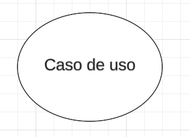
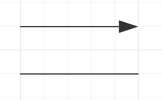
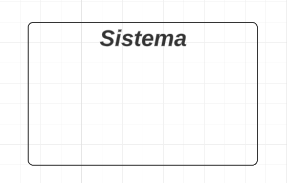

# Cenários

## Introdução
Um diagrama de casos de uso é uma representação visual que descreve as interações entre um sistema e os usuários externos. Ele é composto por uma série de ações, chamadas de casos de uso, que ilustram as principais funcionalidades do sistema e como elas são executadas pelos usuários. Essa ferramenta é útil para documentar e comunicar de forma clara e concisa o comportamento esperado do sistema, bem como a interação entre seus usuários e suas funcionalidades.

## Metodologia
Para a criação desse artefato foi utilizado a abordagem tradicional, ou seja, representação os casos de uso através de uma diagrama UML. A ferramenta utilizada para a criação do diagrama foi o LucidChart, um software online para criação de diagramas.

## Componentes
### Atores
Representam as pessoas que realmente executam os casos de uso. São representados por bonecos palito.

Figura 1: Ator

Fonte: Ian Costa, LucidChart 

### Caso de uso
Representam os diferentes usos que um usuário pode ter. São representados por um formato oval rotulado.

Figura 2: Caso de uso

Fonte: Ian Costa, LucidChart 

### Comunicação
Ação que comunica o usuário ao caso de uso. Pode ser definida como inclusão ou exclusão.

Inclusão: Refere-se à relação em que um caso de uso requer a funcionalidade de outro caso de uso para ser executado. Em termos simples, quando um caso de uso A inclui um caso de uso B, significa que sempre que o caso de uso A for executado, o caso de uso B também será executado obrigatoriamente.

- Notação no diagrama: *<<includes\>\>*

Extensão: Por outro lado, a extensão implica que o caso de uso atual funcionará normalmente, mas alguns novos passos serão adicionados por meio de um caso de uso estendido. Em outras palavras, quando o caso de uso A é estendido pelo caso de uso B, se o caso de uso A for executado, o caso de uso B pode ou não ser executado como uma extensão opcional.
- Notação no diagrama: *<<extends\>\>*

Figura 2: Caso de uso

Fonte: Ian Costa, LucidChart 

### Limite do Sistema
Define um escopo do sistema para os casos de uso. É representado por um retângulo englobando os Casos de  Uso (forma oval rotulada)

Figura 2: Limite do Sistema

Fonte: Ian Costa, LucidChart 

