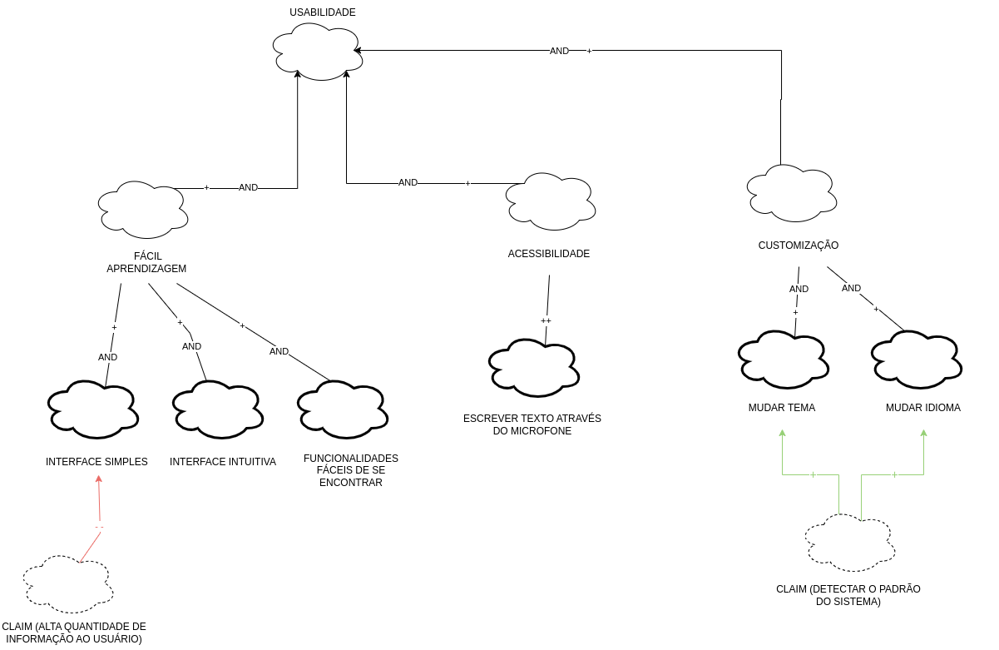
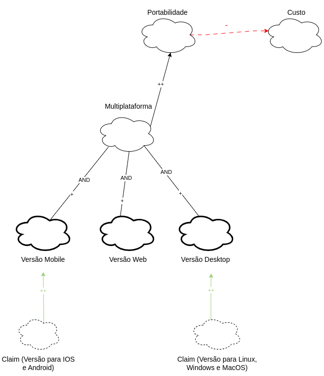

# NFR framework

## Introdução
NFR é um framework conceitual que utiliza o modelo Softgoal Interdependency Graph (SIG). Ele tem como foco os requisitos Não-Funcionais do aplicativo. 
O Framework utiliza de softgoals, um objetivo que não possui uma clara definição nem critérios de satisfação precisos. São utilizados para representar Requisitos 
Não-Funcionais e podem estar inter-relacionados, expressando a influência de uma softgoal em outro.

Os softgoals são separados em 3 tipos:
- NFR Softgoal: É um requisito não-funcional que é considerado durante a análise, a fim de determinar se ele será ou não implementado. 
Esses requisitos são vistos como atributos de qualidade e são avaliados para garantir que o produto final atenda aos padrões desejados. Em outras palavras, eles são critérios usados para avaliar a qualidade do produto.
- Softgoal de Operacionalização: São funcionalidades que permitem viabilizar ou não as características abstratas. Ou seja, elas são responsáveis por transformar os requisitos não-funcionais em funcionalidades tangíveis, que podem ser implementadas no sistema. 
Em resumo, as funcionalidades são a materialização das características abstratas em algo concreto e mensurável
- Claim Softgoal (Argumentation): É a notação que pode ser adicionada ao modelo para argumentar um ponto específico da modelagem e é escrita em linguagem natural. 
Essa notação é uma forma de expressar ideias ou justificativas sobre o modelo e pode ajudar a explicar o raciocínio por trás de certas escolhas.

Além dessa separação, cada um desses softgoals podem ser especificados, serem descritos em formade sub-requisitos:
- Decomposição de Softgoal NFR: Essa técnica que permite uma melhor organização e compreensão dos softgoals NFR.
- Decomposição de Operacionalização: Essa técnica possibilita a definição de uma solução geral e a criação de casos mais especificos.
- Decomposição de Afirmação (Claims): Essa técnica permite reafirmar ou negar as justificativas específicas do projeto.
- Priorização: Essa é um tipo especial de separação, na qual um softgoal é refinado em outro softgoal com o mesmo tipo e tópicos, mas com uma prioridade associada.

Esse refinamento são especificações dos softgoals e são contribuições e existe 10 tipos. Esses são:

| Contribuição       | Descrição  | Notação    |  
| ------------------ | ---------- | ---------- |
| *MAKE*  | FILHO com contribuição tão positiva a ponto de satisfazer o PAI sob a perspectiva dos envolvidos. | ++     | 
| *HELP*  | FILHO com contribuição positiva parcial, que sozinho não chega a satisfazer o PAI sob a perspectiva dos envolvidos. | +     |  
| *UNKNOWN*  | FILHO não afeta o PAI. | ?    |
| *HURT*   | FILHO com contribuição negativa parcial, que sozinho não chega a negar o PAI sob a perspectiva dos envolvidos. | -| 
| *BREAK*    | FILHO com contribuição tão negativa a ponto de negar o PAI sob a perspectiva dos envolvidos| --| 
| *SOME +*   | FILHO com contribuição positiva, cuja intensidade não se pode determinar. | SOME + | 
| *SOME -*   | FILHO com contribuição negativa, cuja intensidade não se pode determinar | SOME - | 
| *AND*    | “Pai” é satisfeito se_somente_se todos os “filhos” forem satisfeitos sob a perspectiva dos envolvidos| AND|
| *OR* | “Pai” é satisfeito se_somente_se um dos “filhos” é satisfeito sob a perspectiva dos envolvidos |OR|    
| *EQUAL* | Ambos compartilham o mesmo label| =| 

## Participantes 

|Nome | Cargo | Técnica | 
|-----|-------|---------|
|Beatriz| Equipe de modelagem| Persona: Alicía|
|Leonardo | Equipe de priorização| Entrevistas da elicitação|
|Mylena | Equipe de elicitação| Público alvo: questionário|
| Paulo | Product Owner | Membro do grupo 4  |

## NFR
 Foram feitos 4 tipos de NFR: usabilidade (figura 2), disponibilidade (figura 3), portabilidade (figura 4) e performance (figura 5). 
## Legenda 

  

<figcaption>Figura 1: Legenda NFR </figcaption>
  

## NFR-1 Usabilidade

 

<figcaption>Figura 2: NFR-1 Usabilidade </figcaption>
 

## NFR-2 Disponibilidade

 

<figcaption>Figura 3: NFR-2 Disponibilidade </figcaption>
 

## NFR-3 Portabilidade

 

<figcaption>Figura 4: NFR-3 Portabilidade </figcaption>
 

## NFR-4 Performance

  
Na figura 5 temos o diagrama de performance. Para a sua elaboração foram utilizados requisitos não funcionais elecitados por meio das técnicas de priorização.
  
  
<figcaption>Figura 5: NFR-4 Performance </figcaption>
  

## Referências

[1] Repositório de disciplina do semestre passado- Lichess

[2] Slides da aula da professora Milene.

[3] [NFR4ES: Um Catálogo de Requisitos Não-Funcionais para Sistemas Embarcados](https://aprender3.unb.br/pluginfile.php/2523130/mod_resource/content/2/DISSERTA%C3%87%C3%83O%20Reinaldo%20Ant%C3%B4nio%20da%20Silva.pdf)

## Histórico de versão

| Versão | Data | Descrição| Autor(es) | Revisor(es)
|--|--|--|--|--|
|`1.0` | 14/05/2023 | Criação da documentação| Mylena, Beatriz e Leonardo |Ana Beatriz|
