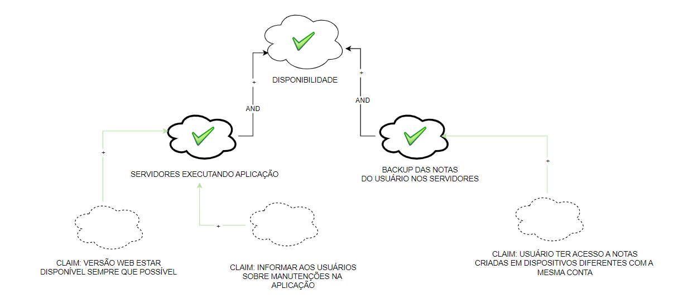
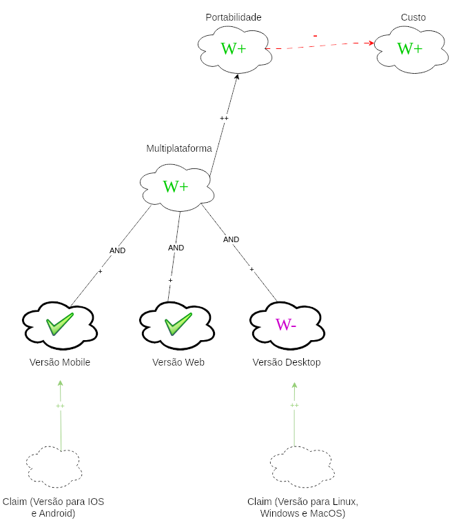

# NFR framework

## Introdução
NFR é um framework conceitual que utiliza o modelo Softgoal Interdependency Graph (SIG). Ele tem como foco os requisitos Não-Funcionais do aplicativo. 
O Framework utiliza de softgoals, um objetivo que não possui uma clara definição nem critérios de satisfação precisos. São utilizados para representar Requisitos 
Não-Funcionais e podem estar inter-relacionados, expressando a influência de uma softgoal em outro. [¹](#ancora1)

### Requisitos Não Funcionais Elicitados

Abaixo, na tabela 1, estão os requisitos não funcionais elicitados pela equipe.

| ID | Requisito | Fonte |
|----|-----------|-------|
|RNF01| Ser capaz de usar a aplicação em dispositivos mobile (celulares e tablets)| [StoryTelling](https://requisitos-de-software.github.io/2023.1-Simplenote/elicitacao/storytelling/)|
|RNF02| Ser capaz de funcionar sem internet	| [StoryTelling](https://requisitos-de-software.github.io/2023.1-Simplenote/elicitacao/storytelling/)|
|RNF03| O aplicativo salvará a nota em até 1 segundo| [Introspecção](https://requisitos-de-software.github.io/2023.1-Simplenote/elicitacao/Introspec%C3%A7%C3%A3o/)|
|RNF04| O aplicativo abrirá em um tempo limite de até 2 segundos| [Introspecção](https://requisitos-de-software.github.io/2023.1-Simplenote/elicitacao/Introspec%C3%A7%C3%A3o/)|
|RNF05| Estar disponível em diversos dispositivos (celulares, laptops, tablets, etc)| [Glossário](https://requisitos-de-software.github.io/2023.1-Simplenote/elicitacao/glossario/)|
|RNF06| Ser capaz de ler e editar arquivos de texto de outras fontes| [Glossário](https://requisitos-de-software.github.io/2023.1-Simplenote/elicitacao/glossario/)|
|RNF07| O aplicativo deve permitir a criação de notas de forma fácil e rápida, sem muitas etapas| [Entrevista](https://requisitos-de-software.github.io/2023.1-Simplenote/elicitacao/entrevista/)|
|RNF08| O aplicativo deve ser acessível em diferentes plataformas, como computadores, tablets e smartphones| [Entrevista](https://requisitos-de-software.github.io/2023.1-Simplenote/elicitacao/entrevista/)|
|RNF09| O aplicativo deve permitir a criação de backups automáticos ou manuais das notas para evitar perda de informação| [Entrevista](https://requisitos-de-software.github.io/2023.1-Simplenote/elicitacao/entrevista/)|
|RNF10| O aplicativo deve ter uma interface simples e fácil de usar, sem muitas opções desnecessárias| [Entrevista](https://requisitos-de-software.github.io/2023.1-Simplenote/elicitacao/entrevista/)|
|RNF11| O aplicativo deve permitir o login com diferentes opções, como e-mail, Google ou Facebook, para facilitar o acesso ao aplicativo após formatação ou troca de dispositivo| [Entrevista](https://requisitos-de-software.github.io/2023.1-Simplenote/elicitacao/entrevista/)|
|RNF12| O aplicativo deve ser confiável e estável, evitando falhas ou perda de dados.| [Brainstorm](https://requisitos-de-software.github.io/2023.1-Simplenote/elicitacao/brainstorming/)|
|RNF13| O aplicativo deve ser responsivo e rápido, permitindo que os usuários criem e acessem suas notas rapidamente.| [Brainstorm](https://requisitos-de-software.github.io/2023.1-Simplenote/elicitacao/brainstorming/)|
|RNF14| O aplicativo deve garantir a segurança e privacidade das notas dos usuários, protegendo-as contra acesso não autorizado ou perda de dados.| [Brainstorm](https://requisitos-de-software.github.io/2023.1-Simplenote/elicitacao/brainstorming/)|
|RNF15| O aplicativo deve ser acessível para usuários com deficiências visuais ou motoras, com recursos como suporte a leitores de tela e opções de zoom.| [Brainstorm](https://requisitos-de-software.github.io/2023.1-Simplenote/elicitacao/brainstorming/)|
|RNF16| O aplicativo deve estar disponível em várias plataformas, como iOS, Android, Windows e Mac, para garantir que os usuários possam acessar suas notas em qualquer dispositivo. | [Brainstorm](https://requisitos-de-software.github.io/2023.1-Simplenote/elicitacao/brainstorming/)|
|RNF17| O aplicativo deve estar disponível para uso sempre que o usuário precisar, sem interrupções ou indisponibilidades não planejadas.| [Brainstorm](https://requisitos-de-software.github.io/2023.1-Simplenote/elicitacao/brainstorming/)|
|RNF18| O aplicativo deve ser otimizado para usar recursos do dispositivo de forma eficiente, como CPU, memória e bateria. | [Brainstorm](https://requisitos-de-software.github.io/2023.1-Simplenote/elicitacao/brainstorming/)|
|RNF19| O aplicativo deve ser facilmente mantido e atualizado, com um código limpo e bem documentado. | [Brainstorm](https://requisitos-de-software.github.io/2023.1-Simplenote/elicitacao/brainstorming/)|
|RNF20| O aplicativo deve ser intuitivo e fácil de usar, com uma interface clara e simples.| [Brainstorm](https://requisitos-de-software.github.io/2023.1-Simplenote/elicitacao/brainstorming/)|

Tabela 1: Requisitos Não Funcionais Elicitados, Autor(a): Beatriz 

### Softgoals

Os softgoals são separados em 3 tipos: [¹](#ancora1)

- NFR Softgoal: É um requisito não-funcional que é considerado durante a análise, a fim de determinar se ele será ou não implementado. 
Esses requisitos são vistos como atributos de qualidade e são avaliados para garantir que o produto final atenda aos padrões desejados. Em outras palavras, eles são critérios usados para avaliar a qualidade do produto.
- Softgoal de Operacionalização: São funcionalidades que permitem viabilizar ou não as características abstratas. Ou seja, elas são responsáveis por transformar os requisitos não-funcionais em funcionalidades tangíveis, que podem ser implementadas no sistema. 
Em resumo, as funcionalidades são a materialização das características abstratas em algo concreto e mensurável
- Claim Softgoal (Argumentation): É a notação que pode ser adicionada ao modelo para argumentar um ponto específico da modelagem e é escrita em linguagem natural. 
Essa notação é uma forma de expressar ideias ou justificativas sobre o modelo e pode ajudar a explicar o raciocínio por trás de certas escolhas.

Além dessa separação, cada um desses softgoals podem ser especificados, serem descritos em formade sub-requisitos:

- Decomposição de Softgoal NFR: Essa técnica que permite uma melhor organização e compreensão dos softgoals NFR.
- Decomposição de Operacionalização: Essa técnica possibilita a definição de uma solução geral e a criação de casos mais especificos.
- Decomposição de Afirmação (Claims): Essa técnica permite reafirmar ou negar as justificativas específicas do projeto.
- Priorização: Essa é um tipo especial de separação, na qual um softgoal é refinado em outro softgoal com o mesmo tipo e tópicos, mas com uma prioridade associada.

Esse refinamento são especificações dos softgoals e são contribuições e existe 10 tipos. Esses são: [¹](#ancora1)

| Contribuição       | Descrição  | Notação    |  
| ------------------ | ---------- | ---------- |
| *MAKE*  | FILHO com contribuição tão positiva a ponto de satisfazer o PAI sob a perspectiva dos envolvidos. | ++     | 
| *HELP*  | FILHO com contribuição positiva parcial, que sozinho não chega a satisfazer o PAI sob a perspectiva dos envolvidos. | +     |  
| *UNKNOWN*  | FILHO não afeta o PAI. | ?    |
| *HURT*   | FILHO com contribuição negativa parcial, que sozinho não chega a negar o PAI sob a perspectiva dos envolvidos. | -| 
| *BREAK*    | FILHO com contribuição tão negativa a ponto de negar o PAI sob a perspectiva dos envolvidos| --| 
| *SOME +*   | FILHO com contribuição positiva, cuja intensidade não se pode determinar. | SOME + | 
| *SOME -*   | FILHO com contribuição negativa, cuja intensidade não se pode determinar | SOME - | 
| *AND*    | “Pai” é satisfeito se_somente_se todos os “filhos” forem satisfeitos sob a perspectiva dos envolvidos| AND|
| *OR* | “Pai” é satisfeito se_somente_se um dos “filhos” é satisfeito sob a perspectiva dos envolvidos |OR|    
| *EQUAL* | Ambos compartilham o mesmo label| =| 

Tabela 2: Refinamento, Autor(a): Mylena 

 
## Participantes 

|Nome | Cargo | Técnica | 
|-----|-------|---------|
|Beatriz| Equipe de modelagem| Modelagem |
|Leonardo | Equipe de priorização| Entrevistas da elicitação|
|Mylena | Equipe de elicitação| Público alvo: questionário|
|Paulo | Product Owner | Membro do grupo 4 |

Tabela 3: Participantes, Autor(a): Mylena 

 
## Legendas

### Softgoals

  

  

 Figura 1: Legenda Softgoals,  Fonte: Beatriz

### Rótulos

  

  

 Figura 2: Legenda Rótulos, Fonte: NFR4ES: Um Catálogo de Requisitos Não-Funcionais para Sistemas Embarcados.¹

Descrição: [¹](#ancora1)

- Satisfeito: Reflete que um requisito não funcional contribui de maneira positiva para a realização de outro requisito, resultando em satisfação.
- Fracamente satisfeito: ndica uma relação de impacto positiva, mas menos forte do que a notação satisfeito.
- Negado: Demonstrando que um requisito não funcional afeta adversamente outro requisito, anulando ou contradizendo sua concretização.
- Fracamente negado: Similar à notação negado, mas com uma relação de negação mais fraca.
- Conflitante: Indica uma relação de conflito entre requisitos não funcionais. Isso implica que os requisitos possuem características tanto positivas quanto negativas.
- Indeterminado: Refere-se a uma relação incerta ou desconhecida entre requisitos não funcionais. Isso ocorre quando há informações insuficientes para determinar o impacto de um requisito em outro.

## NFR
 Foram feitos 4 tipos de NFR: usabilidade (figura 3 e 4), disponibilidade (figura 5 e 6), portabilidade (figura 7 e 8) e performance (figura 9 e 10).

## NFR-1 Usabilidade

### Sem Propagação

Figura 3: NFR-1 Usabilidade Sem Propagação, Autor(a): Beatriz 

### Com Propagação

 

Figura 4: NFR-1 Usabilidade com Propagação, Autor(a): Beatriz

### Requisitos de Usabilidade

| ID  | Requisito |
|-----|-----------|
|RNF07| O aplicativo deve permitir a criação de notas de forma fácil e rápida, sem muitas etapas|
|RNF10| O aplicativo deve ter uma interface simples e fácil de usar, sem muitas opções desnecessárias|
|RNF15| O aplicativo deve ser acessível para usuários com deficiências visuais ou motoras, com recursos como suporte a leitores de tela e opções de zoom.|
|RNF20| O aplicativo deve ser intuitivo e fácil de usar, com uma interface clara e simples.|

Tabela 4: Requisitos de Usabilidade , Autor(a): Beatriz 

### Cartões de Especificação

| Classificação         |  | 
| ----------------------|--|
| Descrição             |  |
| Justificativa         |  |
| Origem do requisito   | Projetista de Software |
| Critério de aceitação |  |
| Prioridade            |  |
| Conflito              |  |
| Historia              | 26 de jun. 2023 |

Tabela 5: Cartões de Especificação .... , Autor(a): Beatriz 

| Classificação         |  | 
| ----------------------|--|
| Descrição             |  |
| Justificativa         |  |
| Origem do requisito   | Projetista de Software |
| Critério de aceitação |  |
| Prioridade            |  |
| Conflito              |  |
| Historia              | 26 de jun. 2023 |

Tabela 6: Cartões de Especificação .... , Autor(a): Beatriz 

## NFR-2 Disponibilidade

### Sem Propagação

 

<figcaption>Figura 5: NFR-2 Disponibilidade, Autor(a): Mylena </figcaption>
 

### Com Propagação

 

 

<figcaption>Figura 6: NFR-1 Disponibilidade com Propagação, Autor(a): Beatriz </figcaption>
 

 
### Requisitos de Disponibilidade

| ID  | Requisito |
|-----|-----------|
|RNF02| Ser capaz de funcionar sem internet	| 
|RNF09| O aplicativo deve permitir a criação de backups automáticos ou manuais das notas para evitar perda de informação|
|RNF11| O aplicativo deve permitir o login com diferentes opções, como e-mail, Google ou Facebook, para facilitar o acesso ao aplicativo após formatação ou troca de dispositivo|
|RNF14| O aplicativo deve garantir a segurança e privacidade das notas dos usuários, protegendo-as contra acesso não autorizado ou perda de dados.| 
|RNF17| O aplicativo deve estar disponível para uso sempre que o usuário precisar, sem interrupções ou indisponibilidades não planejadas.|

Tabela 7: Requisitos de Disponibilidade, Autor(a): Beatriz 

### Cartões de Especificação

| Classificação         |  | 
| ----------------------|--|
| Descrição             |  |
| Justificativa         |  |
| Origem do requisito   | Projetista de Software |
| Critério de aceitação |  |
| Prioridade            |  |
| Conflito              |  |
| Historia              | 26 de jun. 2023 |

Tabela 8: Cartões de Especificação .... , Autor(a): Beatriz 

| Classificação         |  | 
| ----------------------|--|
| Descrição             |  |
| Justificativa         |  |
| Origem do requisito   | Projetista de Software |
| Critério de aceitação |  |
| Prioridade            |  |
| Conflito              |  |
| Historia              | 26 de jun. 2023 |

Tabela 9: Cartões de Especificação .... , Autor(a): Beatriz 

## NFR-3 Portabilidade

### Sem Propagação

Figura 7: NFR-3 Portabilidade, Autor(a): Beatriz  </figcaption>

 ### Com Propagação

 

 

 
 

Figura 8: NFR-1 Portabilidade com Propagação, Autor(a): Beatriz 

### Requisitos de Portabilidade

| ID  | Requisito |
|-----|-----------|
|RNF01| Ser capaz de usar a aplicação em dispositivos mobile (celulares e tablets)|
|RNF05| Estar disponível em diversos dispositivos (celulares, laptops, tablets, etc)|
|RNF08| O aplicativo deve ser acessível em diferentes plataformas, como computadores, tablets e smartphones|
|RNF16| O aplicativo deve estar disponível em várias plataformas, como iOS, Android, Windows e Mac, para garantir que os usuários possam acessar suas notas em qualquer dispositivo.|
|RNF06| Ser capaz de ler e editar arquivos de texto de outras fontes| 

Tabela 10: Requisitos de Portabilidade, Autor(a): Beatriz 

### Cartões de Especificação

| Classificação         |  | 
| ----------------------|--|
| Descrição             |  |
| Justificativa         |  |
| Origem do requisito   | Projetista de Software |
| Critério de aceitação |  |
| Prioridade            |  |
| Conflito              |  |
| Historia              | 26 de jun. 2023 |

Tabela 11: Cartões de Especificação .... , Autor(a): Beatriz 

## NFR-4 Performance

### Sem Propagação

 
 
  
  

 
  

 Figura 9: NFR-4 Performance, Autor(a): Leonardo 
 

  ### Com Propagação

 

Figura 10: NFR-1 Performance com Propagação, Autor(a): Beatriz </figcaption>

### Requisitos de Performance

| ID  | Requisito |
|-----|-----------|
|RNF03| O aplicativo salvará a nota em até 1 segundo|
|RNF04| O aplicativo abrirá em um tempo limite de até 2 segundos|
|RNF12| O aplicativo deve ser confiável e estável, evitando falhas ou perda de dados.|
|RNF13| O aplicativo deve ser responsivo e rápido, permitindo que os usuários criem e acessem suas notas rapidamente.| 
|RNF18| O aplicativo deve ser otimizado para usar recursos do dispositivo de forma eficiente, como CPU, memória e bateria. |
|RNF19| O aplicativo deve ser facilmente mantido e atualizado, com um código limpo e bem documentado. | 

Tabela 12: Requisitos de Performance, Autor(a): Beatriz 

### Cartões de Especificação

| Classificação         |  | 
| ----------------------|--|
| Descrição             |  |
| Justificativa         |  |
| Origem do requisito   | Projetista de Software |
| Critério de aceitação |  |
| Prioridade            |  |
| Conflito              |  |
| Historia              | 26 de jun. 2023 |

Tabela 13: Cartões de Especificação .... , Autor(a): Beatriz 

| Classificação         |  | 
| ----------------------|--|
| Descrição             |  |
| Justificativa         |  |
| Origem do requisito   | Projetista de Software |
| Critério de aceitação |  |
| Prioridade            |  |
| Conflito              |  |
| Historia              | 26 de jun. 2023 |

Tabela 14: Cartões de Especificação .... , Autor(a): Beatriz 

## Referências

> [1] SILVA, Reinaldo Antônio. NFR4ES: Um Catálogo de Requisitos Não-Funcionais para Sistemas Embarcados. Centro de Informática UFPE, Recife, 2019. Disponível em: https://repositorio.ufpe.br/handle/123456789/34150. Acesso em: 26/06/2023
> 

## Histórico de versão

| Versão | Data | Descrição| Autor(es) | Revisor(es)
|--|--|--|--|--|
|`1.0` | 14/05/2023 | Criação da documentação| Mylena, Beatriz e Leonardo |Ana Beatriz|
|`2.0` | 26/06/2023 | Adicionando Propagação, RNF elicitados e Cartões de Especificação| Beatriz |Ana Beatriz|
