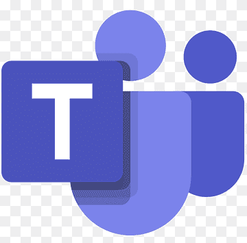

# Ferramentas

## Introdução

As ferramentas serão softwares utilizados pela equipe para facilitar o gerenciamento, comunicação e desenvolvimento da documentação necessária para a realização do projeto da disciplina. Projeto esse que o foco será a análise de requisitos do aplicativo Simplenote.

## Objetivo
Este artefato apresenta as ferramentas utilizadas pelo grupo ao longo projeto, escolhidas com base na funcionalidade que cada uma proporciona, bem como a familiaridade dos participantes. A seguir, 
a tabela 1, apresenta cada ferramenta utilizada, exibindo seus logotipos, descrições do porque foram escolhidas. 

## Metodologia
Vale ressaltar que certas ferramentas foram incluídas ao longo do projeto, mas majoritariamente elas foram escolhidas durante a [primeira reunião realizada](https://github.com/Requisitos-de-Software/2023.1-Simplenote/blob/main/docs/atas.md) onde foram tomadas as decisões iniciais para o projeto.

## Ferramentas utilizadas

| Logo | Ferramenta | Finalidade |
| :-----: | :----: | ----------- |
|  | [Github](https://github.com)  | Utilizado como repositório dos documentos produzidos e para o versionamento deles.  |
|  | [Youtube](https://youtube.com) | Utilizado para hospedar as gravações do projeto. |
|  | [Visual Studio Code](https://code.visualstudio.com)  | Utilizado para manipulação dos arquivos do projeto. |
|  | [Lucidchart](https://lucidchart.com) | Utilizado para elaboração de diagramas.  |
|  | [This Person Doesn't Exist](https://this-person-does-not-exist.com/en) | Utilizado para geração de imagens para as personas. |
| | [Figma](https://www.figma.com)  | Ferramenta para prototipagem |
|  | [OBS studio](https://obsproject.com/) | Utilizado para gravar as reuniões da disciplina |
|  | [WhatsApp](https://www.whatsapp.com/) | Meio de comunicação escolhido pelo grupo |
| | [Autentique](https://www.autentique.com.br) | Ferramenta para organização, elaboração das atas bem como controle de seus participantes. |
|  | [Discord](https://discord.com/) |Ambiente usado para realizar as reuniões |
| | [Canva](https://www.canva.com) | Ferramenta para edição rápida de imagens e composições |
|  | [Google Forms](https://docs.google.com/forms/u/0/) | Ferramenta de elaboração de formulários |
| | [Google Meet](https://meet.google.com/) | Ferramenta utilizadas para reuniões colaborativas |
|  | [Microsoft Teams](https://www.microsoft.com/pt-br/microsoft-teams/) | Ferramenta utilizada para chamadas, reuniões e compartilhamento de arquivos |

Tabela 1: Ferramentas utilizadas no projeto (Fonte: autor, 2023). 

## Bibliografia

> [1] Repositorio Requisitos - Planejamento - Ferramentas. Disponível em: <https://github.com/Requisitos-de-Software/2022.2-Lichess/edit/main/docs/planejamento/ferramentas.md>. Acesso em: 9 de abril de 2023.  

## Histórico de Versão

| Versão | Data    | Descrição                 | Autor(es)     |  Revisor(es)  |
| :-: | :-: | :-: | :-: | :-: |
| `1.0` | 09/04/2023 | Criação do doc e adição das ferramentas | João | Kauã |
| `1.1` | 23/04/2023 | Adição de ferramentas e implementação de feedbacks pós entrega 1| João | Mylena |
| `1.2` | 05/04/2023 | Correção e adição das Ferramentas | Ian | Mylena |
